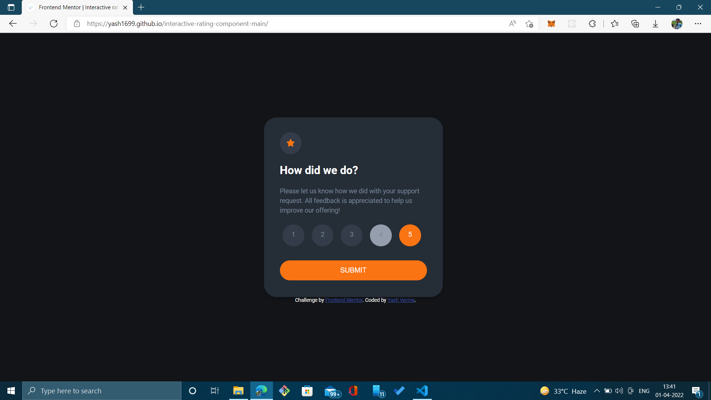
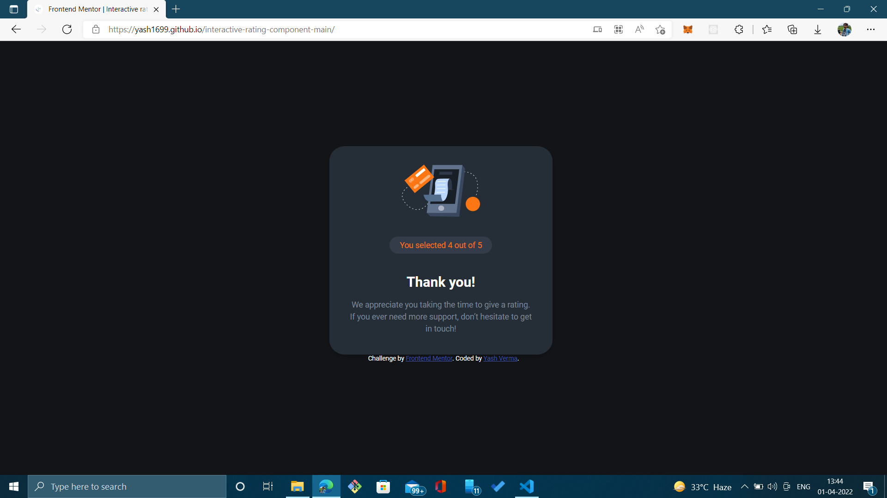
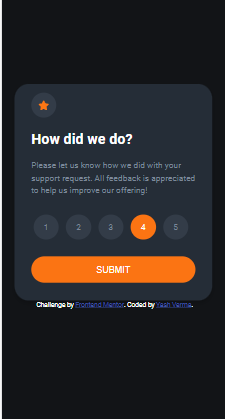
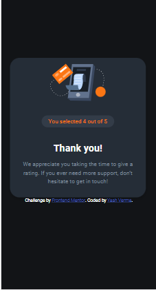

# Frontend Mentor - Interactive rating component solution

This is a solution to the [Interactive rating component challenge on Frontend Mentor](https://www.frontendmentor.io/challenges/interactive-rating-component-koxpeBUmI). Frontend Mentor challenges help you improve your coding skills by building realistic projects. 

## Table of contents

- [Overview](#overview)
  - [The challenge](#the-challenge)
  - [Screenshot](#screenshot)
  - [Links](#links)
- [My process](#my-process)
  - [Built with](#built-with)
  - [What I learned](#what-i-learned)
  - [Continued development](#continued-development)
  - [Useful resources](#useful-resources)
- [Author](#author)

## Overview

### The challenge

Users should be able to:

- View the optimal layout for the app depending on their device's screen size
- See hover states for all interactive elements on the page
- Select and submit a number rating
- See the "Thank you" card state after submitting a rating

### Screenshot






### Links

- Solution URL: [Solution](https://github.com/yash1699/interactive-rating-component-main)
- Live Site URL: [Live Site](https://yash1699.github.io/interactive-rating-component-main/)

## My process

### Built with

- HTML5 markup
- CSS custom properties
- Flexbox
- Javascript

### What I learned

By completing this project i got to know how to make cards using HTML and CSS. I used to have problem with entering contents using CSS but after completing this project i learned some good techniques to use for centering contents. I also learned how to build responsive pages.

```html
<div id="rating-card" class="card">
```
```css
.card {
    box-shadow: 0 4px 8px 0 rgba(0,0,0,0.2);
    padding: 18px;
    padding-top: 30px;
    max-width: 350px;
    margin-top: 12%;
    margin-left: 37%;
    background-color: hsl(213, 19%, 18%);
    border-radius: 7%;
}
```
```js
function submitRating() {
    const ratingCard = document.getElementById('rating-card');
    const thankYouCard = document.getElementById('thank-you-card');
    const span = document.getElementById('rating');

    span.innerHTML = `You selected ${currentSelected} out of 5`;

    ratingCard.style.display = "none";
    thankYouCard.style.display = "flex";
}
```

### Continued development

I learned about building cards but still i am not very comfortable with building cards. So i would like to continue learning not only about card and other UI components too. I would also like to continue learning CSS in general a little more.

### Useful resources

- [W3Schools](https://w3schools.com) - This helped me in building cards. I really liked the simplicity of this site and will use it going forward.
- [StackOverflow](https://stackoverflow.com) - This helped me debug my code. I always use this site for debugging my code and also to learn some best development practices and standards.

## Author

- Frontend Mentor - [@yash1699](https://www.frontendmentor.io/profile/yash1699)
- GitHub - [@yash1699](https://github.com/yash1699)
- LinkedIn - [@yash-verma-5a84641a9](https://linkedin.com/in/yash-verma-5a84641a9)